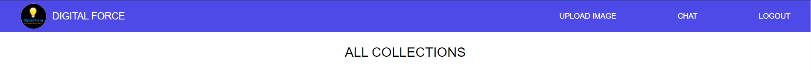
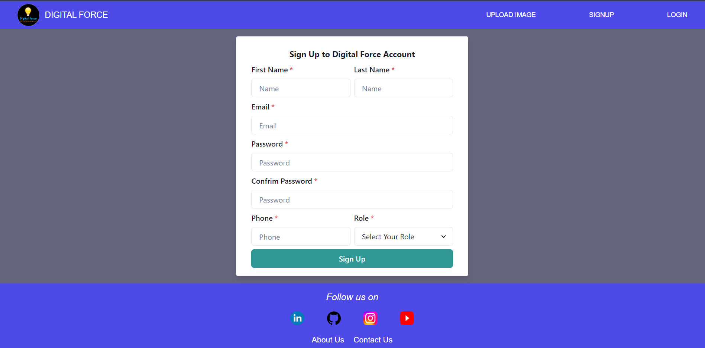
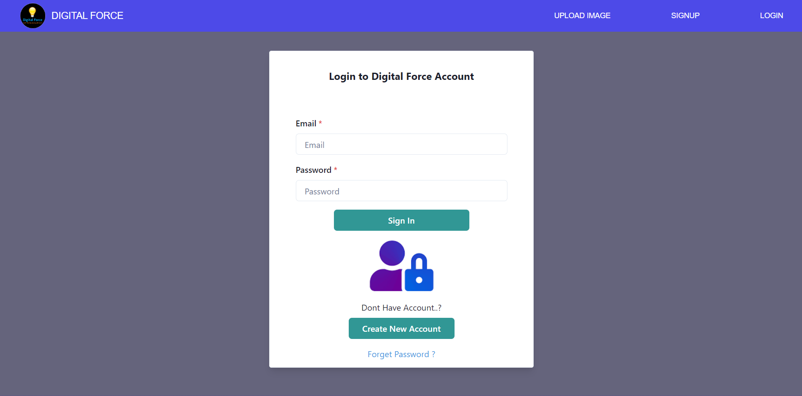
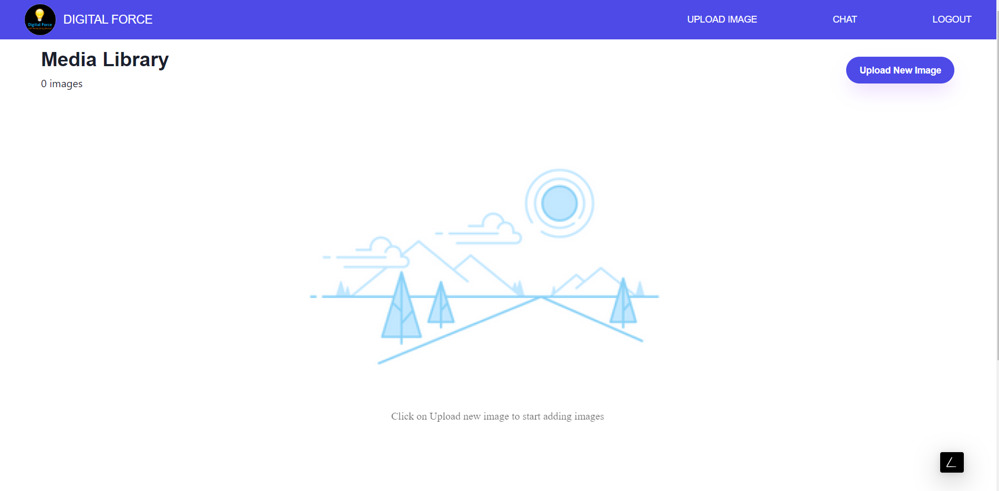
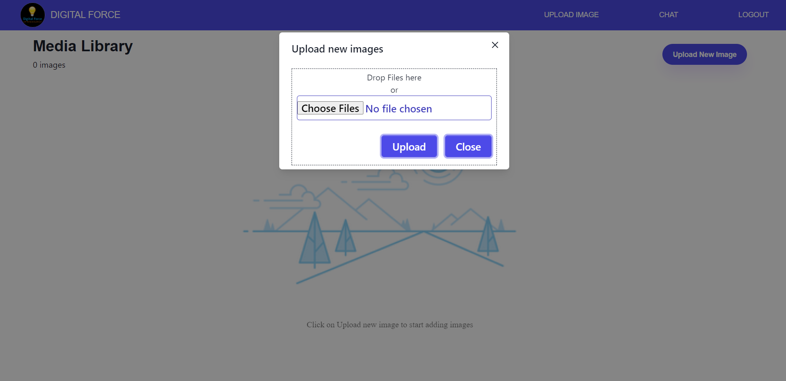
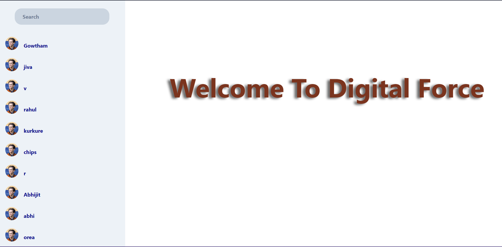
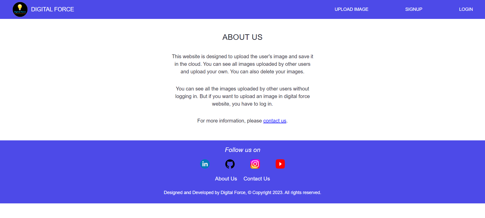
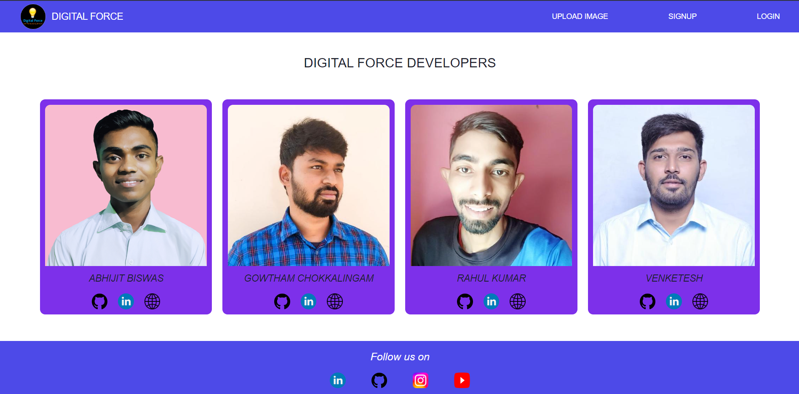

# HACKATHON BY TEAM DIGITAL FORCE

## Team Members

- [Abhijit Biswas](https://github.com/abhijitnr)
- [Gowtham Chokkalingam](https://github.com/Gowtham-Chokkalingam)
- [Rahul Kumar](https://github.com/rahulkr-dev)
- [Venketesh Rushi](https://github.com/VenketeshRushi)

## Deployed link

## Tech-Stack

- Next.js
- Socket.io

## User Guide

- git clone https://github.com/rahulkr-dev/digital_force.git
- cd digital_force
- npm install
- npm run dev
- now you can able to use our Digital Force website

## Overview

### Navbar

- 

### Footer

- 

### Signup

- 

### Login

- 

### User Images

- 

### Upload Image

- 

### Chat Option

- 

### About US

- 

### Contact US

- 
